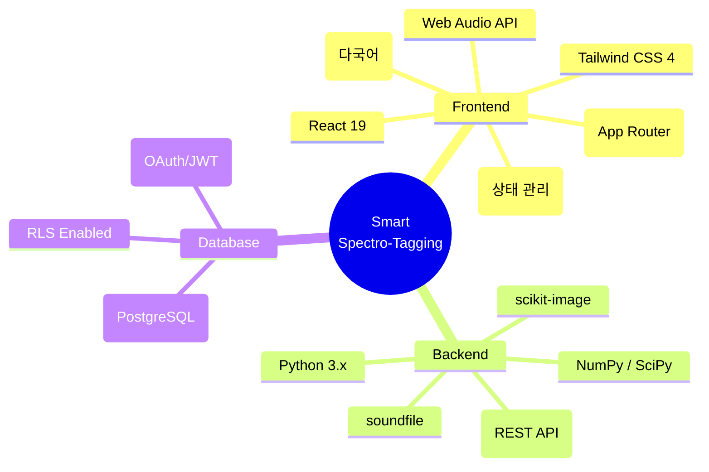
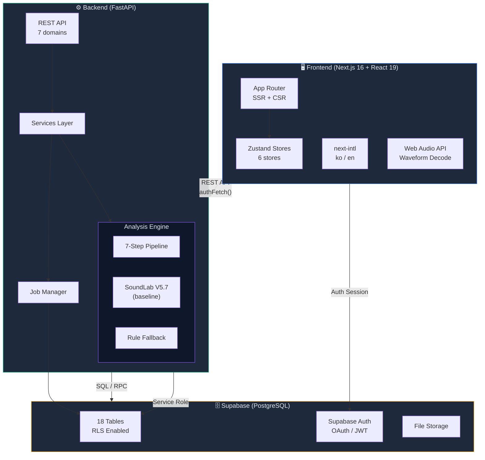
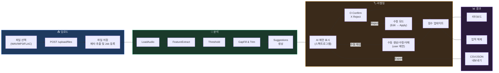

# Smart Spectro-Tagging

AI가 먼저 스펙트로그램 상에서 음향 이상 구간을 제안하고, 사용자가 검수(O/X/F)와 수동 구간 생성(Box)으로 라벨 결과를 완성하는 **협업형 음향 라벨링 플랫폼**입니다. 기존 전문가 의존도가 높았던 음향 라벨링 과정을 직관적인 UX와 게이미피케이션 요소로 풀어내어 누구나 쉽게 참여할 수 있도록 구성되었습니다.

---

## 📌 핵심 기능

- **AI Co-Pilot**: AI 기반 7단계 파이프라인(SoundLab)을 통해 오디오의 이상 구간을 스펙트로그램 위에 선행 제안합니다.
- **Fast Review**: 단축키(`O`: 확정, `X`: 거절, `F`: 수정)를 활용하여 틴더(Tinder)처럼 빠르게 검수할 수 있습니다.
- **Manual Authoring**: 마우스 드래그로 손쉽게 구간을 생성하고 세밀하게 리사이즈/이동 가능한 툴을 지원합니다.
- **Light Gamification**: 라벨링 시 부여되는 점수, 스트릭, 일간 미션 및 리더보드를 통해 작업의 몰입도를 높입니다.

---

## 📂 디렉토리 구조

프로젝트는 프론트엔드와 백엔드가 명확히 분리된 모노레포 형태의 구조를 가지고 있습니다.

```text
GameLab/
├── frontend/       # Next.js 16 (App Router), React 19, Zustand, Tailwind CSS 기반의 웹 애플리케이션
├── backend/        # FastAPI, Python 기반의 분석 엔진 및 REST API 서버
├── docs/           # PRD, 아키텍처 다이어그램(Mermaid), ERD 등 프로젝트 통합 문서
├── ai-context/     # 마스터 플랜, 프로젝트 컨텍스트, 개발 변경 이력 등 AI 보조 참조 문서
├── scripts/        # 프로젝트 빌드 및 유틸리티 스크립트
└── skills/         # AI 에이전트 스킬 및 커스텀 프롬프트 정의
```

*위 구조는 실제 프로젝트 디렉토리 트리와 일치하도록 구성되었습니다.*

---

## 🛠 기술 스택



---

## 🏗 시스템 아키텍처

프론트엔드와 백엔드 로직이 분리되어 연동되며, Supabase를 통해 Auth 및 RLS가 구성되어 있습니다.



---

## 🔄 데이터 흐름 파이프라인

1. 사용자가 파일을 업로드하면 `sst_jobs` 작업으로 등록됩니다.
2. 분석 엔진이 7-Step 방식으로 특징 추출, 노이즈 제거, 임계값 분석 단계를 거쳐 AI 라벨링 추론값을 내놓습니다.
3. 이를 라벨링 워크스페이스에서 수정하거나 확인하며, 최종으로 데이터를 Export 합니다.



---

## 📚 참조 문서

상세 기획, 디자인 시안, 상태 관리 흐름, 모델 계층 및 변경 이력은 아래 폴더들의 문서를 확인해 주세요.

* **[docs/architecture-diagrams.md](./docs/architecture-diagrams.md)** : 상세 ERD, API 명세, 상태관리(Zustand), 분석 엔진 파이프라인 시각화 모음 중심
* **[docs/Prd.md](./docs/Prd.md)** : 프로덕트 요구사항 명세 (MVP 및 향후 Phase 정보 포함)
* **[ai-context/project-context.md](./ai-context/project-context.md)** : 실시간 개발 싱크, 모델-API 매핑 원칙, 최신 맥락 정보 유지용
