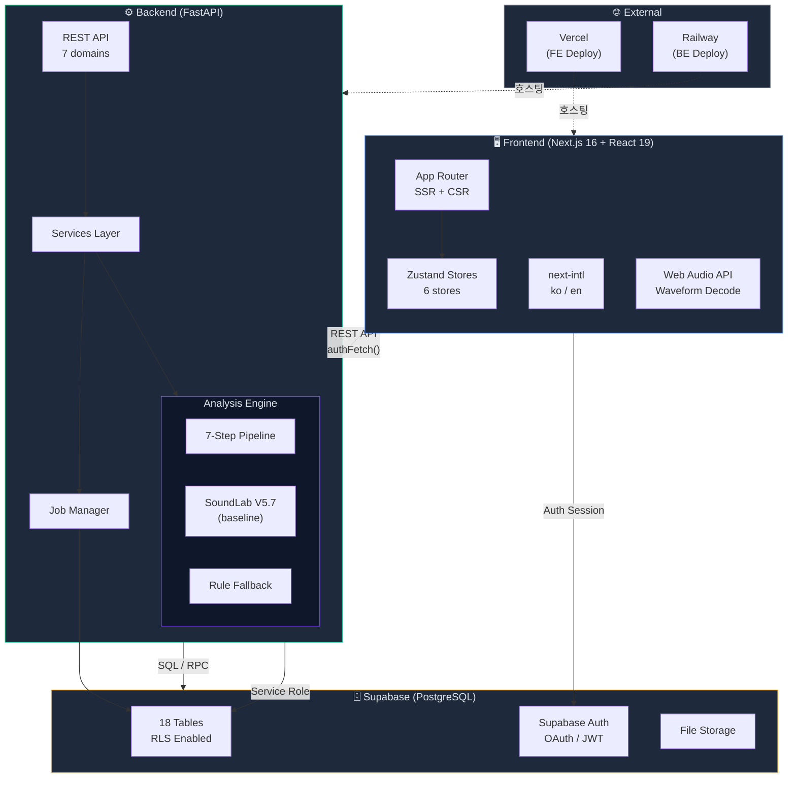
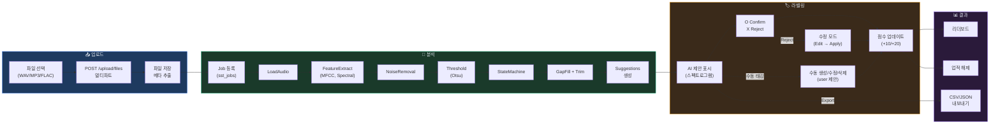
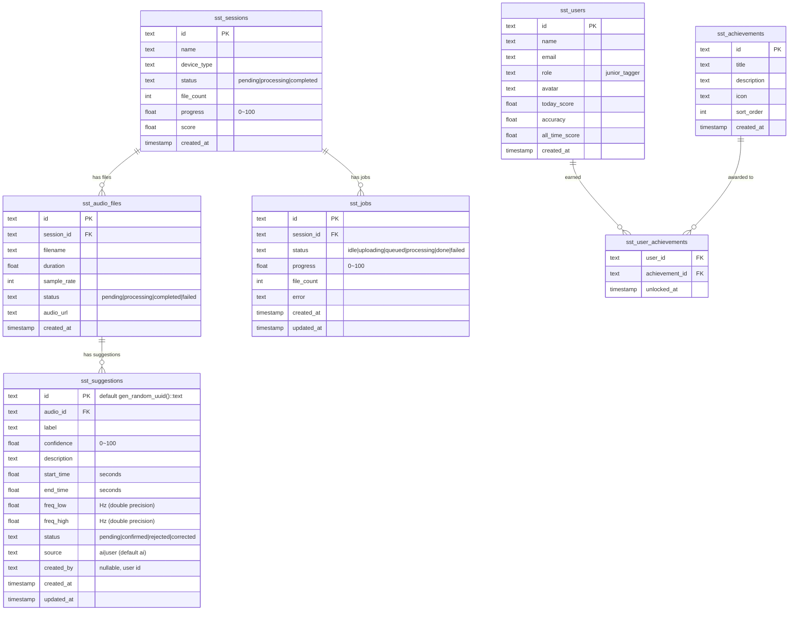
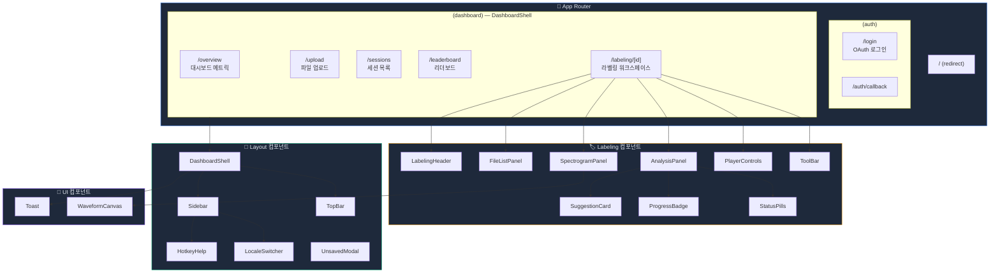
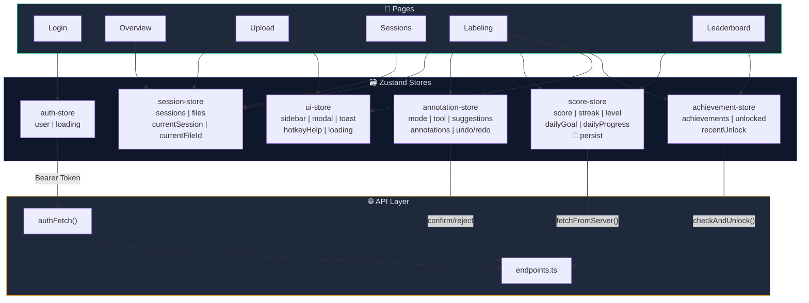
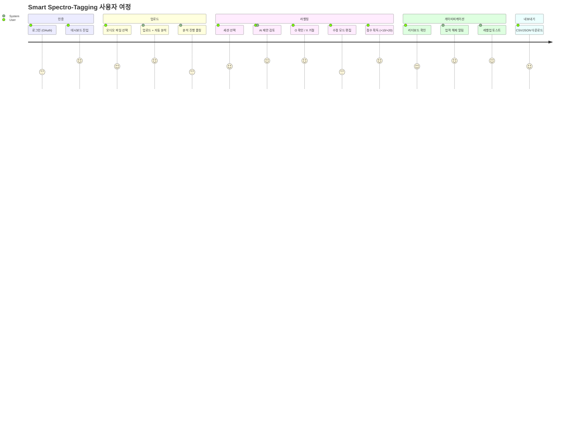
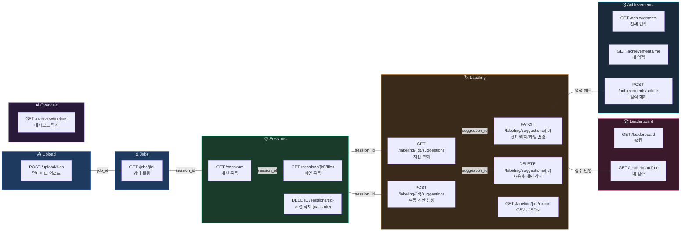
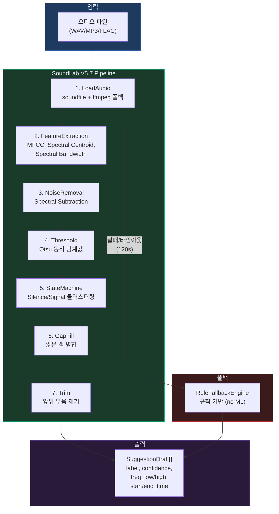
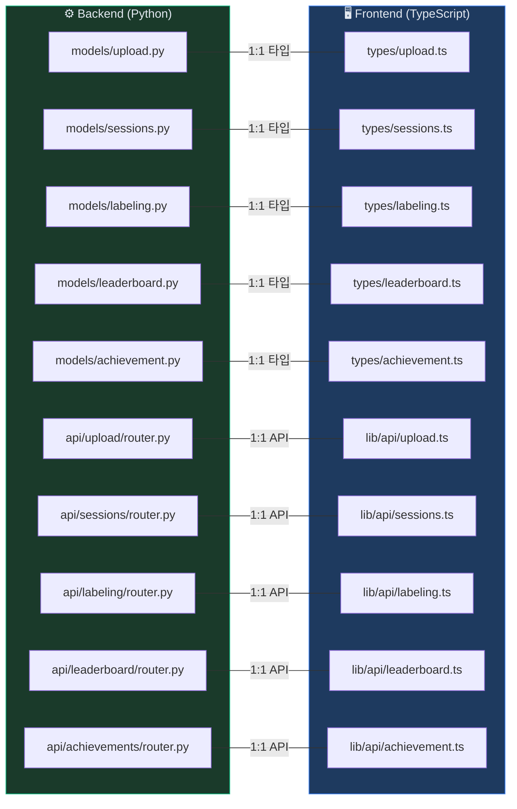
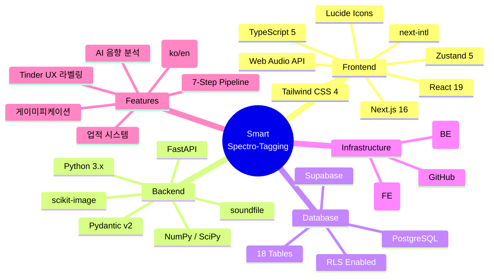

# Smart Spectro-Tagging — 프로젝트 시각화

> Mermaid 기반 다이어그램. GitHub, Notion, VS Code(Mermaid Preview)에서 렌더링 가능.

---

## 1. 시스템 아키텍처

---

## 2. 데이터 흐름 (핵심 파이프라인)

---

## 3. ERD (데이터베이스 관계도)

---

## 4. 프론트엔드 라우트 & 컴포넌트 트리

---

## 5. 상태관리 흐름 (Zustand Stores)

---

## 6. 사용자 여정 (User Journey)

---

## 7. API 엔드포인트 맵

---

## 8. 분석 엔진 파이프라인

---

## 9. BE ↔ FE 미러 구조

---

## 10. 기술 스택 요약

