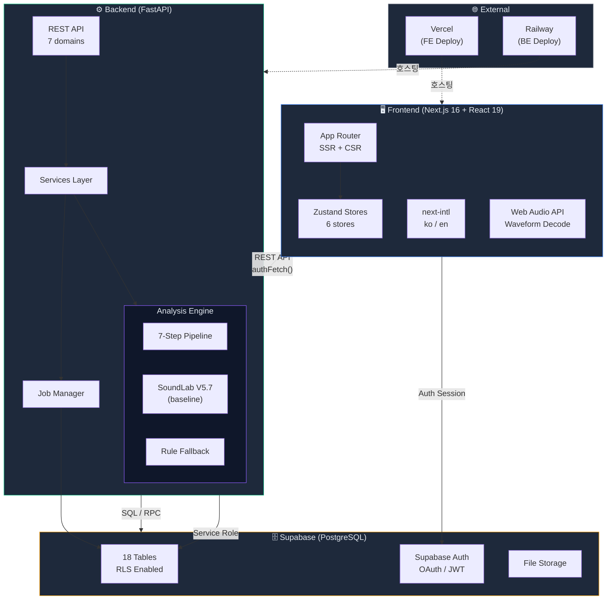
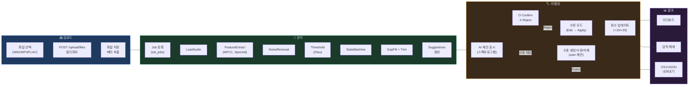
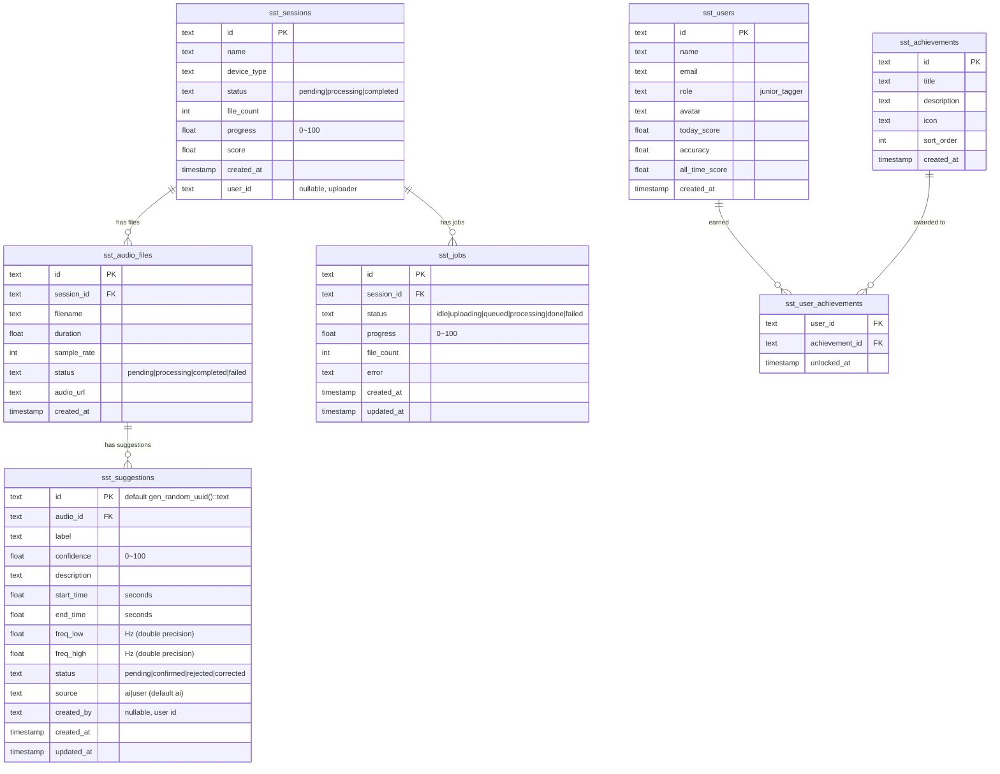
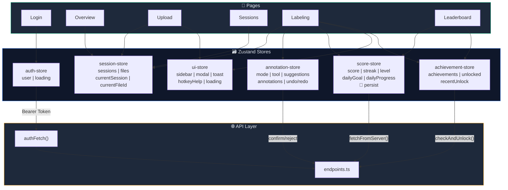
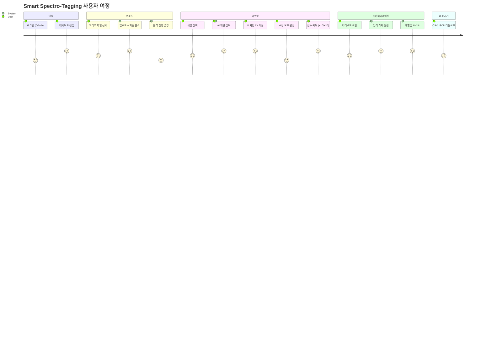
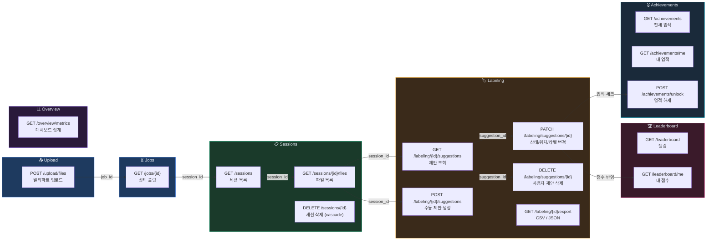
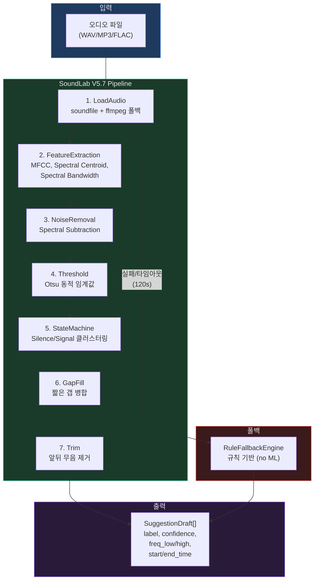
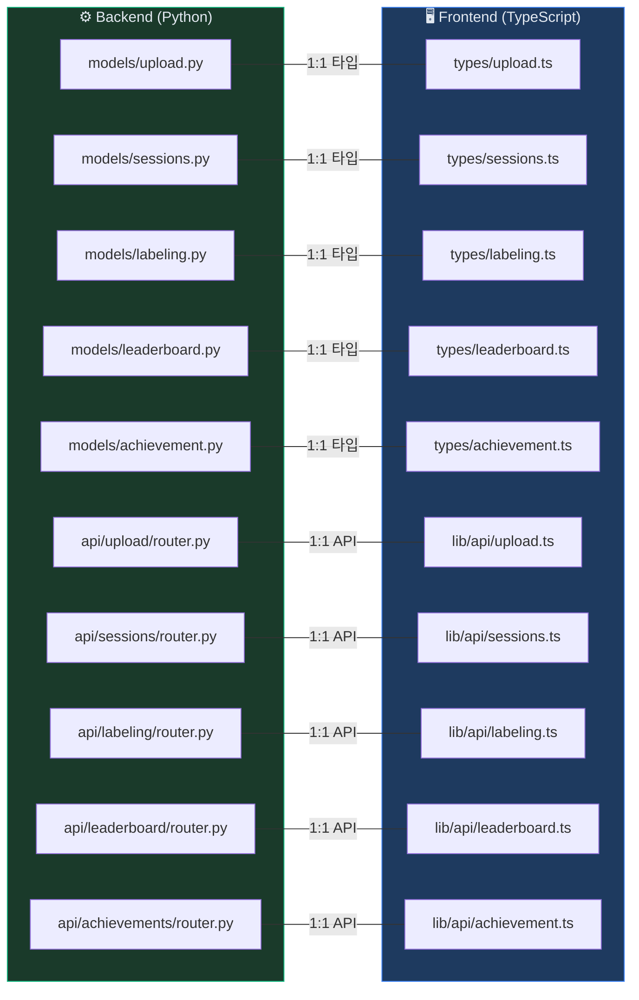
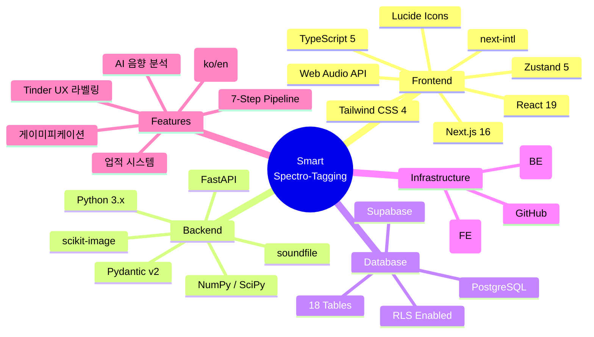

# Smart Spectro-Tagging — 프로젝트 시각화

> Mermaid 기반 다이어그램. GitHub, Notion, VS Code(Mermaid Preview)에서 렌더링 가능.

---

## 1. 시스템 아키텍처



---

## 2. 데이터 흐름 (핵심 파이프라인)



---

## 3. ERD (데이터베이스 관계도)



---

## 4. 프론트엔드 라우트 & 컴포넌트 트리

```mermaid
graph TD
  subgraph Routes["📁 App Router"]
    Root["/ (redirect)"]
    subgraph AuthGroup["(auth)"]
      Login["/login<br/>OAuth 로그인"]
      Callback["/auth/callback"]
    end
    subgraph Dashboard["(dashboard) — DashboardShell"]
      Overview["/overview<br/>대시보드 메트릭"]
      Upload["/upload<br/>파일 업로드"]
      Sessions["/sessions<br/>세션 목록"]
      Leaderboard["/leaderboard<br/>리더보드"]
      LabelingId["/labeling/[id]<br/>라벨링 워크스페이스"]
    end
  end

  subgraph LabelingComponents["🏷️ Labeling 컴포넌트"]
    LH["LabelingHeader"]
    FLP["FileListPanel"]
    SP["SpectrogramPanel"]
    AP["AnalysisPanel"]
    PC["PlayerControls"]
    SC["SuggestionCard"]
    TB["ToolBar"]
    PB["ProgressBadge"]
    StP["StatusPills"]
  end

  subgraph LayoutComponents["🧩 Layout 컴포넌트"]
    DS["DashboardShell"]
    SB["Sidebar"]
    TopBar["TopBar"]
    HK["HotkeyHelp"]
    LS["LocaleSwitcher"]
    UM["UnsavedModal"]
  end

  subgraph UIComponents["🎨 UI 컴포넌트"]
    Toast["Toast"]
    WC["WaveformCanvas"]
  end

  Dashboard --> DS
  DS --> SB
  DS --> TopBar
  DS --> Toast
  SB --> LS
  SB --> HK
  LabelingId --> LH
  LabelingId --> FLP
  LabelingId --> SP
  LabelingId --> AP

---

## 7. Labeling Workspace 확장 모듈 (2026-03-03 결정)

- 신규 오디오 모듈 계층(프론트):
  - `frontend/src/lib/audio/listening-types.ts`
  - `frontend/src/lib/audio/segment-playback.ts`
  - `frontend/src/lib/audio/wav-export.ts`
- 적용 범위:
  - `/labeling/[id]` 라우트 내부에만 통합
- 런타임 제어:
  - `NEXT_PUBLIC_ENABLE_SPECTRO_LISTENING_V1` 플래그로 점진 활성화
- 의도:
  - 기존 `use-audio-player`와 독립된 선택구간 전용 청취/내보내기 경로 제공
  LabelingId --> PC
  LabelingId --> TB
  SP --> WC
  AP --> SC
  AP --> StP
  AP --> PB

  style Routes fill:#1e293b,stroke:#3b82f6,color:#e2e8f0
  style LabelingComponents fill:#1e293b,stroke:#f59e0b,color:#e2e8f0
  style LayoutComponents fill:#1e293b,stroke:#10b981,color:#e2e8f0
  style UIComponents fill:#1e293b,stroke:#8b5cf6,color:#e2e8f0
```

---

## 5. 상태관리 흐름 (Zustand Stores)



---

## 6. 사용자 여정 (User Journey)



---

## 7. API 엔드포인트 맵



---

## 8. 분석 엔진 파이프라인



---

## 9. BE ↔ FE 미러 구조



---

## 10. 기술 스택 요약


